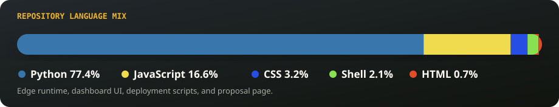

# Angel Gates

Premium gate-access and incident-evidence layer for properties with existing barrier-arm gates.

Angel Gates does **not** replace DoorKing, the existing metal call box, the gate operator, or gate safety equipment. It runs beside the current setup as a value-add asset: faster visitor access, timestamped gate events, existing-camera evidence, and property-manager incident delivery.

## Proposal

- Interactive proposal: https://dacameragirl.github.io/angel-gates/proposal.html
- PDF copy: [Angel_Gates_DoorKing_Proposal.pdf](Angel_Gates_DoorKing_Proposal.pdf)
- Markdown source: [docs/DOORKING_ADD_ON_PROPOSAL.md](docs/DOORKING_ADD_ON_PROPOSAL.md)

## What Angel Gates Adds

- Resident and visitor QR/PIN access.
- Time-limited guest, delivery, vendor, contractor, and family passes.
- Faster gate flow compared with the old call-box/keypad routine.
- Reduced shared-code abuse by tying passes to a sponsor and expiration time.
- Timestamped access events.
- Existing camera/NVR evidence when the property camera system is accessible.
- Property-manager incident emails for gate damage, denied access, possible unauthorized entry, and camera-review windows.
- Evidence packets for chargebacks, resident notices, vendor disputes, insurance, or board review.

## DoorKing Positioning

The current DoorKing setup remains the foundation.

Angel Gates is the add-on layer beside it:

- DoorKing box, keypad, operator, free-exit loop, photo eyes, reversing edges, and safety devices stay in place.
- Angel Gates adds an edge controller, QR/PIN reader, local event log, camera evidence links, and manager email workflow.
- A qualified gate/access installer handles field wiring.
- The system sends only an authorized momentary open command after a local allow decision.

## Why Properties Want It

The old metal call box can stay, but it should not be the only visitor workflow.

Angel Gates helps properties answer:

- Who came through the gate at this time?
- Was this a resident, visitor, vendor, or expired pass?
- Did someone try to follow another car in?
- What did the existing camera see at that timestamp?
- Can the manager send an incident record instead of manually scrubbing video?
- Is there enough evidence to charge back gate-arm damage?

## 90-Day Pilot Shape

- One gate.
- Existing DoorKing setup remains in place.
- QR/PIN access for selected residents, visitors, vendors, and managers.
- Existing camera/NVR used as the evidence source if accessible.
- Incident email alerts to the property manager.
- Event review and basic incident export.
- No DoorKing replacement.
- No gate safety modification.

## Current Build Status

Shipped in this repo:

- Edge authorization runtime.
- Local SQLite credential cache.
- Local PIN, plate, and signed QR authorization.
- Ed25519 QR token verification using cached public keys.
- Revocation support for credentials and QR tokens.
- Offline event queueing.
- Hash-chained event log verification.
- Cloud anchor publisher and append-only witness storage.
- Commissioning identity and rebind flow.
- Local HTTP API for reader/controller integration.
- Relay service with GPIO driver support.
- QR scanner service.
- RTSP camera capture service.
- Chargeback incident export to JSON, CSV, and printable Markdown.
- Pilot acceptance runner.
- Raspberry Pi first-boot package with systemd services.

## Safety Boundary

Angel Gates is an authorization and evidence layer, equivalent to adding a keypad or reader controller.

It does not control, modify, certify, bypass, or monitor gate operator safety functions. Existing DoorKing operator behavior, loops, photo eyes, reversing edges, entrapment protection, signage, emergency access, and other site safety systems remain in place.

Installation must be performed by a qualified gate/access installer.

This repository is not a certification claim, legal opinion, installer manual, or hardware safety approval.

## Developer Notes

Open `index.html` in a browser for the local dashboard shell. The app uses browser local storage and has no package dependencies.

Run the edge checks:

```powershell
python -m compileall edge
python -m unittest edge.tests.test_edge_runtime
```

Optional syntax check:

```powershell
node --check src/app.js
```

## Project Map

- `proposal.html` - public proposal page.
- `proposal.css` - proposal page styling and print/PDF fallback rules.
- `Angel_Gates_DoorKing_Proposal.pdf` - email-friendly proposal copy.
- `index.html` - local dashboard shell.
- `styles.css` - dashboard UI styling.
- `src/app.js` - dashboard shell, local workspace forms, audit events, export, and import.
- `edge/` - local edge controller runtime and tests.
- `deploy/pi/` - Raspberry Pi first-boot setup, systemd units, env template, and service runners.
- `docs/EDGE_ARCHITECTURE.md` - edge-first product architecture.
- `docs/COMMISSIONING.md` - installer-facing commissioning and device identity flow.
- `docs/PILOT.md` - first-property pilot plan and success metrics.
- `docs/FIELD_DISCOVERY.md` - field questions for cost, dial-pad, and decision validation.
- `docs/HARDWARE.md` - physical bill of materials and wiring boundary.
- `docs/PRICING.md` - working pricing model and competitive positioning.
- `docs/MARKETING.md` - first-property marketing plan, pitch, and proof points.
- `docs/CHARGEBACK.md` - incident and damaged-arm evidence workflow.
- `docs/SAFETY_BOUNDARY.md` - UL 294 / UL 325 boundary language.

## Data Policy

The dashboard stores only records entered through the browser UI or imported from a workspace JSON file. Clearing browser storage or using the in-app clear action removes local records from that browser.

The edge runtime creates schema only. It does not seed controller, resident, visitor, pass, credential, integration, or audit data.
